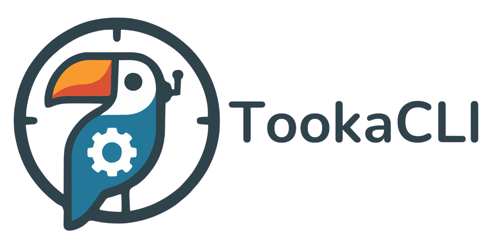

# 🗂️ Tooka

[![clippy]](https://github.com/Benji377/tooka/actions/workflows/clippy.yml)
[![test]](https://github.com/Benji377/tooka/actions/workflows/test.yml)

[clippy]: https://img.shields.io/github/actions/workflow/status/Benji377/tooka/clippy.yml?label=Clippy&logo=rust&style=for-the-badge&labelColor=555555
[test]: https://img.shields.io/github/actions/workflow/status/Benji377/tooka/test.yml?label=Tests&logo=githubactions&style=for-the-badge&labelColor=555555

<div align="center">
  
</div>

A fast, rule-based CLI tool for organizing files.

---

## 🧭 Introduction

**Tooka** is a flexible command-line tool for automating your filesystem: organize, rename, move, copy, or delete files using simple, powerful YAML rules.

You define what files to match (by name, extension, metadata, size, etc.) and what should happen to them — Tooka handles the rest with blazing-fast parallel processing. With built-in background monitoring, Tooka can continuously keep your folders organized automatically.

---

## ✨ Features

* **Rule-based automation** - Define custom file organization rules using declarative YAML
* **Automatic monitoring** - Set up background monitoring to automatically sort folders at intervals
* **High-performance** - Parallel recursive directory traversal and file operations
* **Flexible filtering** - Match files by name patterns, extensions, MIME types, size, metadata, and timestamps
* **Multiple actions** - Move, copy, rename, delete, or skip files based on conditions
* **Template support** - Dynamic file naming with customizable templates
* **Safe operations** - Dry-run mode and comprehensive logging for safety
* **Cross-platform** - Works seamlessly on Windows, macOS, and Linux

---

## 📦 Installation

```bash
git clone https://github.com/Benji377/tooka.git
cd tooka
cargo build --release
```

---

## 🚀 Quick Start

```bash
# Sort files based on rules
tooka sort /path/to/folder --rules rules.yaml

# Monitor folder automatically
tooka monitor add ~/Downloads --interval 300
tooka monitor daemon run
```

See the [Wiki](https://github.com/Benji377/tooka/wiki) for detailed documentation and examples.

---

## 🚀 Performance

Tooka is designed for speed with:
- Parallel file processing using Rayon
- Optimized hot paths with cached operations
- Comprehensive benchmark suite to track performance

Run performance benchmarks:
```bash
cargo run --release --bin performance_benchmarks
```

See [benches/README.md](benches/README.md) for details.

---

## 🤝 Contributing

We welcome contributions! Please see:

- [Contributing Guidelines](CONTRIBUTING.md) 
- [Code of Conduct](CODE_OF_CONDUCT.md)
- [GitHub Discussions](https://github.com/Benji377/tooka/discussions) for ideas and questions

---

## 💬 Community & Support

- **Bug Reports**: [GitHub Issues](https://github.com/Benji377/tooka/issues)
- **Feature Requests**: [GitHub Discussions](https://github.com/Benji377/tooka/discussions)
- **Documentation**: [Wiki](https://github.com/Benji377/tooka/wiki)

---

## 📜 License

Licensed under [GPLv3](LICENSE)

---

<div align="center">
  <sub>Built with ❤️ in Italy 🇮🇹</sub>
</div>
